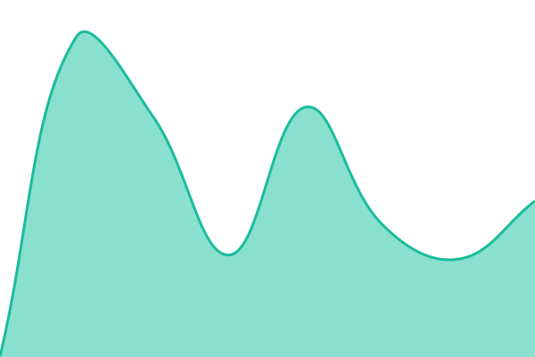

# [📈 Live Status](https://upptime.github.io/upptime): <!--live status--> **🟧 Partial outage**

This repository contains the open-source uptime monitor and status page for [Upptime](https://upptime.js.org), powered by [Upptime](https://github.com/upptime/upptime).

With [Upptime](https://upptime.js.org), you can get your own unlimited and free uptime monitor and status page, powered entirely by a GitHub repository. We use [Issues](https://github.com/upptime/upptime/issues) as incident reports, [Actions](https://github.com/fredbradley/uptime/actions) as uptime monitors, and [Pages](https://upptime.github.io/upptime) for the status page.

<!--start: status pages-->
<!-- This summary is generated by Upptime (https://github.com/upptime/upptime) -->
<!-- Do not edit this manually, your changes will be overwritten -->
<!-- prettier-ignore -->
| URL | Status | History | Response Time | Uptime |
| --- | ------ | ------- | ------------- | ------ |
|  [Senior School Website](https://www.cranleigh.org) | 🟩 Up | [senior-school-website.yml](https://github.com/fredbradley/upptime/commits/HEAD/history/senior-school-website.yml) | 

 1047ms
     
 | 

<a href="https://uptime.cran.ly/history/senior-school-website">100.00%</a>
    

|  [Prep School Website](https://www.cranprep.org) | 🟩 Up | [prep-school-website.yml](https://github.com/fredbradley/upptime/commits/HEAD/history/prep-school-website.yml) | 

 1628ms
     
 | 

<a href="https://uptime.cran.ly/history/prep-school-website">100.00%</a>
    

|  [Abu Dhabi](https://www.cranleigh.ae) | 🟩 Up | [abu-dhabi.yml](https://github.com/fredbradley/upptime/commits/HEAD/history/abu-dhabi.yml) | 

 1752ms
     
 | 

<a href="https://uptime.cran.ly/history/abu-dhabi">100.00%</a>
    

|  [Admissions Portal](https://admissions.cranleigh.org) | 🟩 Up | [admissions-portal.yml](https://github.com/fredbradley/upptime/commits/HEAD/history/admissions-portal.yml) | 

 662ms
     
 | 

<a href="https://uptime.cran.ly/history/admissions-portal">100.00%</a>
    

|  [WP Public Network](https://wordpress-public.cranleigh.org) | 🟩 Up | [wp-public-network.yml](https://github.com/fredbradley/upptime/commits/HEAD/history/wp-public-network.yml) | 

 1008ms
     
 | 

<a href="https://uptime.cran.ly/history/wp-public-network">100.00%</a>
    

|  [OC Society](https://www.ocsociety.org) | 🟩 Up | [oc-society.yml](https://github.com/fredbradley/upptime/commits/HEAD/history/oc-society.yml) | 

 1317ms
     
 | 

<a href="https://uptime.cran.ly/history/oc-society">100.00%</a>
    

|  [Blogs Network](https://blogs.cranleigh.org) | 🟩 Up | [blogs-network.yml](https://github.com/fredbradley/upptime/commits/HEAD/history/blogs-network.yml) | 

 1107ms
     
 | 

<a href="https://uptime.cran.ly/history/blogs-network">100.00%</a>
    

|  [Awesome Book Awards](https://www.awesomebookawards.com) | 🟥 Down | [awesome-book-awards.yml](https://github.com/fredbradley/upptime/commits/HEAD/history/awesome-book-awards.yml) | 

 0ms
     
 | 

<a href="https://uptime.cran.ly/history/awesome-book-awards">0.00%</a>
    

|  [VMT Dashboard](https://vmt.cranleigh.org) | 🟩 Up | [vmt-dashboard.yml](https://github.com/fredbradley/upptime/commits/HEAD/history/vmt-dashboard.yml) | 

 1740ms
     
 | 

<a href="https://uptime.cran.ly/history/vmt-dashboard">100.00%</a>
    

|  [Cranleigh Activities](https://www.cranleighactivities.org) | 🟩 Up | [cranleigh-activities.yml](https://github.com/fredbradley/upptime/commits/HEAD/history/cranleigh-activities.yml) | 

 875ms
     
 | 

<a href="https://uptime.cran.ly/history/cranleigh-activities">100.00%</a>
    

|  [Raise a Concern](https://raiseaconcern.cranleigh.org) | 🟩 Up | [raise-a-concern.yml](https://github.com/fredbradley/upptime/commits/HEAD/history/raise-a-concern.yml) | 

 1351ms
     
 | 

<a href="https://uptime.cran.ly/history/raise-a-concern">100.00%</a>
    

|  [Service Desk](https://servicedesk.cranleigh.org) | 🟩 Up | [service-desk.yml](https://github.com/fredbradley/upptime/commits/HEAD/history/service-desk.yml) | 

 542ms
     
 | 

<a href="https://uptime.cran.ly/history/service-desk">100.00%</a>
    

|  [Asset Bank](https://assetbank.cranleigh.org) | 🟥 Down | [asset-bank.yml](https://github.com/fredbradley/upptime/commits/HEAD/history/asset-bank.yml) | 

 0ms
     
 | 

<a href="https://uptime.cran.ly/history/asset-bank">0.00%</a>
    

|  [tHRive](https://cranleigh.app.ciphr.com/) | 🟩 Up | [t-h-rive.yml](https://github.com/fredbradley/upptime/commits/HEAD/history/t-h-rive.yml) | 

 543ms
     
 | 

<a href="https://uptime.cran.ly/history/t-h-rive">100.00%</a>
    

<!--end: status pages-->

[**Visit our status website →**](https://upptime.github.io/upptime)

## 📄 License

- Powered by: [Upptime](https://github.com/upptime/upptime)
- Code: [MIT](./LICENSE) © [Upptime](https://upptime.js.org)
- Data in the `./history` directory: [Open Database License](https://opendatacommons.org/licenses/odbl/1-0/)
